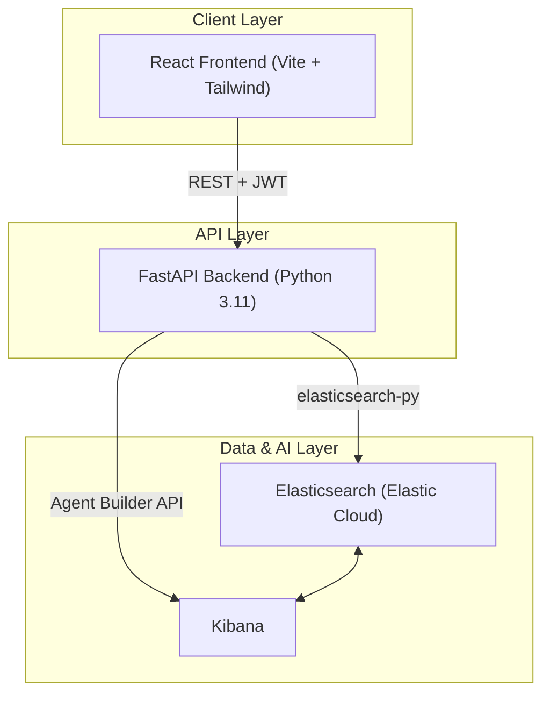
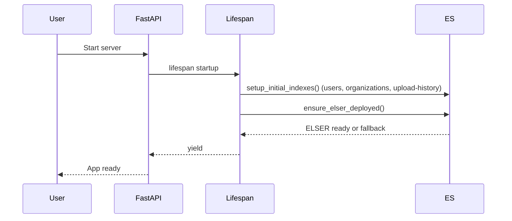
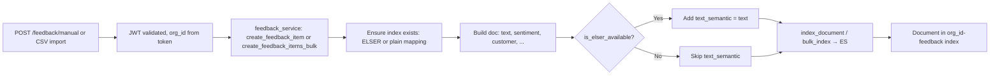
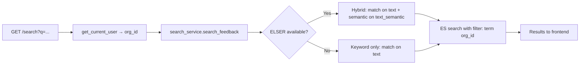

# Context Engine v2

**Feedback intelligence platform for Product Managers.** Monitor customer feedback from every source, detect emerging issues, and generate production-ready engineering specs. Powered by Elasticsearch.

[](https://opensource.org/licenses/MIT)

---

## Table of Contents

- [Overview](#overview)
- [Features](#features)
- [Architecture](#architecture)
- [Flow Charts](#flow-charts)
- [Tech Stack](#tech-stack)
- [Data Model & Indices](#data-model--indices)
- [Security & Multi-Tenancy](#security--multi-tenancy)
- [Setup](#setup)
- [Environment Variables](#environment-variables)
- [API Overview](#api-overview)
- [Project Structure](#project-structure)
- [License](#license)

---

## Overview

Context Engine v2 is a **production-grade feedback intelligence platform** for Product Managers. It replaces traditional SQL backends with **Elasticsearch** as the single source of truth, enabling:

- **Semantic search** (ELSER) so queries like "checkout broken" match feedback such as "The page timed out and I lost my data."
- **Real-time analytics** via ES|QL and aggregations.
- **AI Agent** (Elasticsearch Agent Builder) with tools for search, trends, customer lookup, and spec generation.
- **4-document spec output** (PRD, Architecture, Rules, Plan) backed by real feedback and product context.

PMs sign up, complete an optional 8-step product wizard, upload feedback (CSV or manual), and use the dashboard, search, agent chat, and spec generator—all with strict **multi-tenant isolation** (Organization A never sees Organization B's data).

---

## Features

| Area | Capabilities |
|------|--------------|
| **Auth** | Email/password signup & login, JWT, org-scoped access |
| **Product context** | 8-step wizard: basics, areas, goals, segments, competitors, roadmap, teams, tech stack |
| **Feedback** | CSV upload, manual entry, 11 source types, sentiment, ELSER semantic field |
| **Search** | Hybrid (keyword + semantic), filters, similar-feedback |
| **Customers** | Profiles, ARR, health score, renewal date, feedback history |
| **Agent** | 7 tools (search, trends, top issues, similar, customer lookup, compare segments, spec prep) |
| **Specs** | 4-doc generation, save, view, download, regenerate |
| **Dashboard** | Summary metrics, volume chart, sentiment breakdown, top issues, at-risk customers, etc. |
| **Analytics** | Kibana dashboards (embedded), ES|QL-backed widgets |

---

## Architecture

### High-Level Diagram



### Component Overview

| Layer | Component | Role |
|-------|-----------|------|
| **Frontend** | React + Vite + Tailwind | SPA: auth, dashboard, feedback, customers, specs, analytics, settings, agent chat panel |
| **Backend** | FastAPI | REST API, JWT auth, org_id injection, business logic, ES client singleton |
| **Search & storage** | Elasticsearch | Only datastore: users, orgs, per-org feedback/customers/product-context/specs, ELSER embeddings |
| **Agent & dashboards** | Kibana | Agent Builder (converse, tools), optional embedded dashboards |

### Elasticsearch Singleton & CORS

- **ES client:** One global client created on first use; reads `ELASTICSEARCH_URL` or `ELASTICSEARCH_CLOUD_ID` and `ELASTICSEARCH_API_KEY` from `.env` (no hardcoded credentials).
- **CORS:** Configured from `BACKEND_CORS_ORIGINS` (comma-separated). Default: `http://localhost:3000`, `http://localhost:5173`.

---

## Flow Charts

### 1. Application Startup



### 2. Feedback Ingestion (Manual or CSV)



### 3. Hybrid Search Flow



### 4. Multi-Tenancy (Org Isolation)

```mermaid
flowchart TB
    A[Request with Bearer JWT] --> B[get_current_user dependency]
    B --> C[Decode JWT, extract sub, org_id, email]
    C --> D[Return current_user dict]
    D --> E[Route handler uses current_user['org_id']]
    E --> F[All ES queries: filter term org_id]
    E --> G[All indices: org_id-feedback, org_id-customers, ...]
    F --> H[Organization B cannot see Organization A data]
```

### 5. Spec Generation Data Flow


---

## Tech Stack

| Layer | Technologies |
|-------|--------------|
| **Frontend** | React 18, TypeScript, Vite, Tailwind CSS, React Router, Axios, Lucide React |
| **Backend** | Python 3.11+, FastAPI, Pydantic, python-jose (JWT), bcrypt |
| **Data & search** | Elasticsearch 8.x (Elastic Cloud), ELSER, semantic_text, ES|QL |
| **Agent** | Elasticsearch Agent Builder (Kibana API), 7 ES|QL tools |
| **Infrastructure** | Docker Compose (backend + frontend), Elastic Cloud (ES + Kibana) |

---

## Data Model & Indices

| Index | Purpose |
|-------|---------|
| `users` | User accounts (email, hashed password, org_id) |
| `organizations` | Org records (onboarding_completed, etc.) |
| `{org_id}-feedback` | Feedback items; optional `text_semantic` (ELSER) |
| `{org_id}-customers` | Customer profiles (ARR, health, segment) |
| `{org_id}-product-context` | Product wizard data (8 sections) |
| `{org_id}-specs` | Generated spec documents |
| `{org_id}-conversations` | Agent chat history |
| `upload-history` | Upload metadata (org_id in each doc) |

**No PostgreSQL or SQLite.** Elasticsearch is the only datastore.

---

## Security & Multi-Tenancy

- **JWT:** Issued at login; contains `sub`, `org_id`, `email`. Validated on every protected route via `get_current_user`.
- **Org isolation:** Every data request uses `org_id` from the token. Indices are per-org; queries always include `{"term": {"org_id": org_id}}`. Single-doc reads verify `doc.org_id == org_id` before returning.
- **Secrets:** All credentials from `.env` (no hardcoded secrets in code).

---

## Setup

### Prerequisites

- Docker and Docker Compose
- Elastic Cloud deployment (or Elasticsearch 8.x with API key)
- Node 18+ (if running frontend without Docker)

### Steps

1. **Clone the repository**

   ```bash
   git clone https://github.com/weeklyweights-a11y/Context-engine.git
   cd Context-engine
   ```

2. **Configure environment**

   ```bash
   cp .env.example .env
   ```

   Edit `.env` and set at least:

   - `ELASTICSEARCH_URL` or `ELASTICSEARCH_CLOUD_ID`
   - `ELASTICSEARCH_API_KEY`
   - `JWT_SECRET_KEY` (use a long random string in production)
   - Optionally: `KIBANA_URL`, `KIBANA_API_KEY` for the agent

3. **Run with Docker Compose**

   ```bash
   docker compose up
   ```

4. **Open in browser**

   - Frontend: http://localhost:3000
   - Backend: http://localhost:8000
   - API docs: http://localhost:8000/docs

---

## Environment Variables

| Variable | Description | Required |
|----------|-------------|----------|
| `ELASTICSEARCH_URL` | Elasticsearch cluster URL | Yes (or Cloud ID) |
| `ELASTICSEARCH_CLOUD_ID` | Elastic Cloud deployment ID | Yes (or URL) |
| `ELASTICSEARCH_API_KEY` | API key for ES | Yes |
| `JWT_SECRET_KEY` | Secret for signing JWTs | Yes (change in production) |
| `JWT_ALGORITHM` | e.g. HS256 | No (default HS256) |
| `JWT_ACCESS_TOKEN_EXPIRE_MINUTES` | Token TTL | No (default 1440) |
| `BACKEND_CORS_ORIGINS` | Allowed frontend origins (comma-separated) | No (default localhost) |
| `API_V1_PREFIX` | API prefix, e.g. /api/v1 | No |
| `KIBANA_URL` | Kibana base URL (for Agent Builder) | For agent |
| `KIBANA_API_KEY` | Kibana API key | For agent |
| `AGENT_ID` | Agent identifier | No (default context-engine-agent) |
| `SPEC_INFERENCE_ID` | ES inference endpoint for spec LLM | Optional (fallback: Kibana) |
| `VITE_API_BASE_URL` | Backend API URL for frontend | For frontend build |

---

## API Overview

All endpoints are under `/api/v1` and (except auth) require `Authorization: Bearer <token>`.

| Group | Examples |
|-------|----------|
| **Auth** | POST /auth/signup, POST /auth/login |
| **Health** | GET /health |
| **Product** | GET/PUT /product/wizard/{section}, GET /product/onboarding-status, POST /product/onboarding-complete |
| **Feedback** | POST /feedback/manual, POST /feedback/upload-csv, POST /feedback/upload-csv/{id}/import, GET /feedback, GET /feedback/{id} |
| **Search** | GET /search?q=... |
| **Customers** | GET /customers, GET /customers/{id}, POST /customers/import, ... |
| **Specs** | POST /specs/generate, GET /specs, GET /specs/{id}, ... |
| **Agent** | POST /agent/chat, GET /agent/conversations, GET /agent/conversations/{id} |
| **Analytics** | GET /analytics/summary, /volume, /sentiment-breakdown, ... |

---

## Project Structure

```
.
├── backend/
│   ├── app/
│   │   ├── main.py              # FastAPI app, lifespan, CORS, routers
│   │   ├── config.py            # Settings from .env
│   │   ├── dependencies.py      # get_current_user, JWT
│   │   ├── es_client.py         # Elasticsearch singleton
│   │   ├── models/              # Index names, mappings (feedback, customer, product, ...)
│   │   ├── routers/             # auth, feedback, search, product, specs, agent, analytics, ...
│   │   ├── services/            # feedback_service, search_service, spec_service, agent_service, ...
│   │   ├── schemas/             # Pydantic request/response models
│   │   └── utils/               # security (JWT), logging
│   ├── Dockerfile
│   └── requirements.txt
├── frontend/
│   ├── src/
│   │   ├── App.tsx
│   │   ├── pages/               # Dashboard, Feedback, Customers, Specs, Analytics, Settings
│   │   ├── components/         # wizard, feedback, upload, agent chat, ...
│   │   ├── services/           # API clients
│   │   └── hooks/
│   ├── Dockerfile
│   └── package.json
├── docker-compose.yml
├── .env.example
└── README.md
```

---

## License

MIT.
